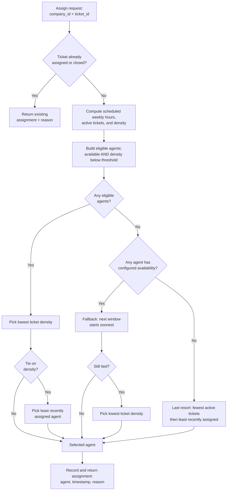

# Product Requirements Document: Support Ticket Assignment

## 1. Problem Statement

Today, support tickets are assigned manually by a team lead. As the team grows and agents work across different timezones, shifts, and days, this manual process breaks down:

* Tickets that arrive while the lead is offline sit unassigned for hours.
* The lead becomes a bottleneck, spending most of their time triaging instead of doing higher-value work.
* Workload is distributed unevenly: some agents are overwhelmed while others are idle.
* When a ticket is assigned to a particular agent, the lead has no structured way to explain why that choice was made.

This product automates ticket assignment. Given a company and a ticket, it picks an agent who is currently working, respects each agent's workload capacity based on their scheduled availability, balances work fairly across the team, and leaves no ticket without an owner. The team lead can see coverage gaps, current workload distribution, and the reason behind every assignment decision.

## 2. Target User

The only user is the **Support Team Lead**.

* Defines and updates when each agent is available, in which timezone, and how much work they can reasonably handle through their schedules.
* Monitors team coverage to find gaps where no one is scheduled to work.
* Reviews ticket assignments to understand why a specific ticket was assigned to a specific agent.

## 3. Scope

### In Scope

* **Availability management:** Add, edit, and remove weekly recurring time windows for each agent, with a timezone.
* **Coverage visualization:** Weekly 24/7 Gantt chart with red-tinted coverage gaps.
* **Ticket assignment API:** Given `company_id` and `ticket_id`, return an assigned agent and a reason.
* **Workload-aware assignment:** Determine agent eligibility and assignment using ticket density (active tickets per scheduled weekly hour) and a fixed maximum ticket-density threshold.
* **Assignment tracking:** Store and display ticket assignments.
* **Ticket closing:** Close an assigned ticket from the tickets UI so it leaves the agent's active workload. No reopen or full resolution workflow.
* **Single-page UI:** Dashboard, agents section, tickets section, and edit availability modal.

### Out of Scope

* Authentication, authorization, roles, and user management.
* Company, agent, and ticket creation (seeded data only).
* Billing, payments, or account management.
* Mobile UI.
* Holiday calendars.
* One-off overrides or temporary schedule changes.
* Third-party integrations (PagerDuty, Opsgenie, etc.).
* Daylight Saving Time (DST) transitions: availability is stored in fixed UTC offsets.
* Reopening closed tickets or a full ticket-resolution workflow (statuses beyond Assigned / Closed, SLAs, etc.).
* Deployment or hosting (runs locally only).

## 4. Goals & Success Criteria

1. **No unowned ticket:** 100% of assignment API calls return an assigned agent, including via fallback.
2. **Coverage gaps are visible:** The UI shows a weekly Gantt chart; uncovered time slots are highlighted in red.
3. **Workload is balanced:** Tickets are distributed fairly among eligible agents while respecting availability and workload limits.
4. **Assignments are explainable:** 100% of assignment API responses include a non-empty reason string, and the UI displays it.

## 5. Key Definitions

| Term | Definition |
| --- | --- |
| **Available** | An agent is available at a given moment if the current UTC time falls within one of their scheduled weekly windows. |
| **Scheduled weekly hours** | The total number of hours an agent is scheduled to work each week, calculated from their recurring availability windows. |
| **Active ticket** | A ticket that is assigned to an agent and has not been closed. Active tickets are the agent's current workload. |
| **Ticket density** | The number of active tickets assigned to an agent divided by their scheduled weekly hours. |
| **Eligible** | An agent is eligible to receive a ticket if they are currently available and their ticket density is below the maximum ticket-density threshold. |
| **Maximum ticket-density threshold** | A fixed system-wide limit on ticket density (active tickets per scheduled weekly hour). It is not configurable through the UI in this version. |
| **Coverage gap** | A fixed 30-minute weekly slot that is not fully covered by the union of all agents' availability windows. Any uncovered portion of the slot leaves it as a gap. The target is 24/7 coverage. |
| **Fairness** | Tickets are distributed among eligible agents by preferring the agent with the lowest ticket density. |
| **Assignment reason** | A short, human-readable string returned by the API explaining why the selected agent was chosen (e.g., availability, ticket density, fallback). |

## 6. Core Product Behavior

### 6.1 Availability Management

* Each agent has a weekly recurring schedule made of time windows.
* Each window has: day of week, start time, end time, and timezone.
* Each window is scoped to a single day of the week and cannot cross midnight. Overnight coverage (e.g., a shift spanning 22:00–02:00) must be entered as two separate windows — one ending at 23:59 on the first day, one starting at 00:00 on the following day.
* The UI lets the lead edit an agent's schedule and timezone.
* The system converts local window times to UTC for storage.
* Overlapping or adjacent windows for the same agent (within the same day) are merged automatically.

### 6.2 Coverage Gaps

* The UI renders a weekly 24/7 **Gantt chart** showing all agent windows.
* For this MVP, coverage is evaluated in fixed 30-minute slots across the week. The UI stays at this coarse granularity, but gap detection must not hide partial gaps.
* A 30-minute slot is **covered** only when the union of all agents' availability windows covers the entire slot. If any portion of the slot is uncovered, the slot is a **coverage gap**.
* Coverage gaps are highlighted in red.

### 6.3 Assignment Algorithm & Explainability

When the assignment API is invoked for a ticket (via the UI **Assign** button or an external caller):

1. If the ticket is already assigned or closed, return the existing assignment and reason instead of creating a new assignment (idempotent — see §6.4).
2. Load the company's agents and calculate each agent's scheduled weekly hours and active ticket count.
3. Compute ticket density for each agent with scheduled weekly hours greater than zero (active tickets divided by scheduled weekly hours). Agents with zero scheduled weekly hours have no density and cannot be density-eligible.
4. Build the list of **eligible** agents: currently available (per §5), scheduled weekly hours greater than zero, and ticket density below the maximum ticket-density threshold.
5. If eligible agents exist, choose the one with the lowest ticket density.
6. If multiple agents share the lowest ticket density, choose the one assigned a ticket least recently. Agents with no prior assignment are treated as least recently assigned.
7. If no eligible agents exist, but at least one agent has configured availability, fall back to the agent whose next scheduled window starts soonest (to prioritize earliest possible handling). If still tied, pick the one with the lowest ticket density.
8. If no agent has any configured availability, use a last-resort fallback so the ticket still gets an owner: pick among all agents by fewest active tickets, then least recently assigned. The reason must state that availability could not be respected and this last-resort fallback was used.
9. Record the assignment (agent, timestamp, reason) and return the result.

The reason string is included in every API response and displayed in the UI (ticket table §7.5, agent card detail §7.3).

#### Design Rationale

Ticket density is used instead of raw ticket count because agents may work different numbers of hours each week. Comparing tickets relative to scheduled weekly hours distributes work proportionally across part-time and full-time agents.

Least-recently-assigned is used as the tie-breaker to avoid repeatedly selecting the same agent when multiple agents have identical ticket density.

When no currently eligible agent exists but at least one agent has configured availability, assigning to the agent whose next window starts soonest ensures every ticket immediately has an owner while prioritizing who can begin handling it soonest.

When no agent has any configured availability, density and next-window fallback do not apply. The product still assigns an owner (fewest active tickets, then least recently assigned) so a new ticket is never left without an owner, and the reason string records that this last-resort path deliberately could not respect availability.

> **Note:** Agents with zero scheduled weekly hours are excluded from density-based eligibility and from the next-window fallback (they have no window). They remain candidates only for the last-resort path in step 8.

### 6.4 Ticket Lifecycle

* Tickets are seeded in an unassigned state.
* The assignment API is called with `company_id` and `ticket_id`, either from the UI **Assign** button or by an external caller.
* The API determines the best agent, records the assignment (agent, timestamp, reason), and returns the result.
* If the assignment API is called on a ticket that is already assigned or closed, it returns the existing assignment and reason rather than creating a new assignment (idempotent behavior, not an error).
* Once assigned, a ticket cannot be reassigned through the UI in this version.
* An assigned ticket can be **closed** from the tickets UI. Closing removes it from the agent's active workload (and therefore from ticket density). Closed tickets cannot be reopened in this version.

## 7. UI/UX Overview

The UI is a single-page application for the support team lead.

### 7.1 Top Stats Bar

* Total number of agents in the company.
* Total number of tickets submitted.
* Number of active (assigned, not closed) tickets.
* Number of unassigned tickets (tickets that have not yet been processed by the assignment API).
* Number of closed tickets.

### 7.2 Coverage Gantt Chart

* Weekly, 24/7 view showing each agent's availability windows.
* Coverage gaps are highlighted in red.
* Serves as the primary view for spotting uncovered time slots.

### 7.3 Agents Section

* Cards for each agent showing: name, agent ID, timezone, scheduled weekly hours, and current ticket density.
* Each card lists the agent's active tickets (assigned and not closed).
* Each card has an **Edit availability** button that opens a modal.

### 7.4 Edit Availability Modal

* Single timezone dropdown for the agent (applies to all windows).
* Day-wise time slot editor: add or remove start/end windows for each day of the week.
* Saves as recurring weekly windows.

### 7.5 Tickets Section

* Table of all tickets submitted to the API.
* Columns: ticket ID, status (Unassigned / Assigned / Closed), assigned agent, assignment time, reason, and action.
* Unassigned tickets have an **Assign** button that invokes the assignment API.
* Assigned tickets show the assignment reason and a **Close** button that marks the ticket closed and removes it from active workload.
* Closed tickets are read-only; they retain their assignment history and cannot be reopened or reassigned.
* Expandable row or tooltip for full assignment details.

## 8. Assumptions

* Companies, agents, and tickets are pre-seeded. The UI does not create or delete them.
* Agent IDs and ticket IDs are unique within a company.
* The browser timezone is used for displaying local times in the UI, including the Gantt chart.
* A ticket can only be assigned once. Reassignment is not supported.
* An agent's scheduled weekly hours are derived from their recurring availability windows and recalculated whenever those windows are modified.
* A fixed maximum ticket-density threshold (active tickets per scheduled weekly hour) is used for all companies. The threshold is a system constant and is not configurable in this version.
* Closing a ticket only affects active workload; it does not delete the ticket or clear its assignment history.
* The company always has at least one agent in the seeded data so last-resort assignment has a candidate.
